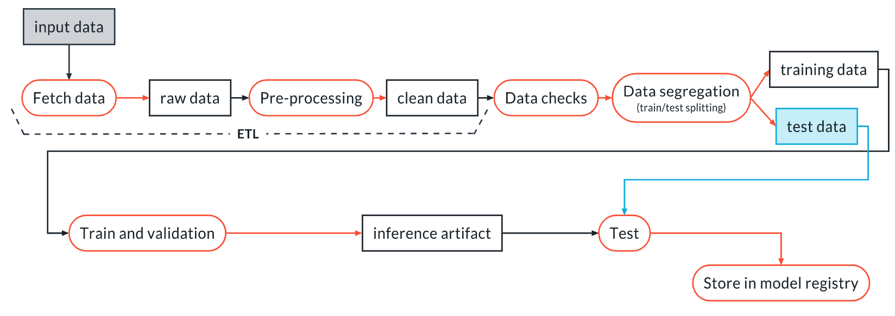

# Build an ML Pipeline for Short-Term Rental Prices in NYC
You are working for a property management company renting rooms and properties for short periods of 
time on various rental platforms. You need to estimate the typical price for a given property based 
on the price of similar properties. Your company receives new data in bulk every week. The model needs 
to be retrained with the same cadence, necessitating an end-to-end pipeline that can be reused.

In this project you will build such a pipeline.

## Project Steps

- Fetch the raw data
- Clean and pre-process data
- Test the data
- Train the machine learning model with the training dataset
- Select the best model and test the model with the test dataset
- Release the machine learning pipeline

## Pipeline

Pipeline being built within the project

## Links
- [Github Repo](https://github.com/pat2388/Project-Build-an-ML-Pipeline-Starter)
- [WANDB Project](https://wandb.ai/ptiern1-western-governors-university/nyc_airbnb)

## License

[License](LICENSE.txt)
